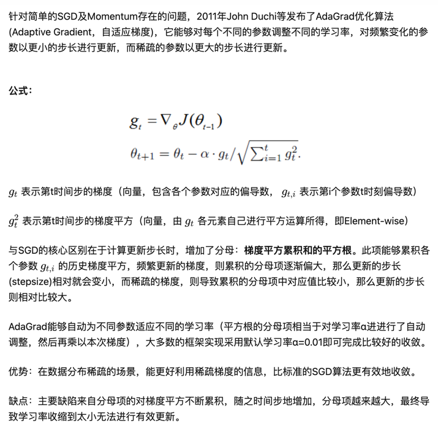
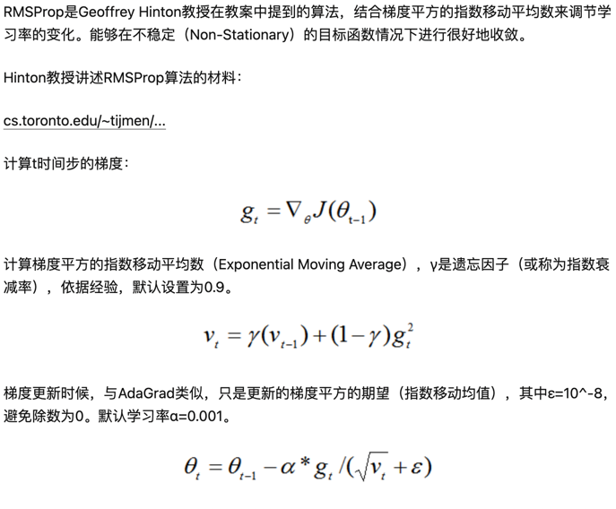
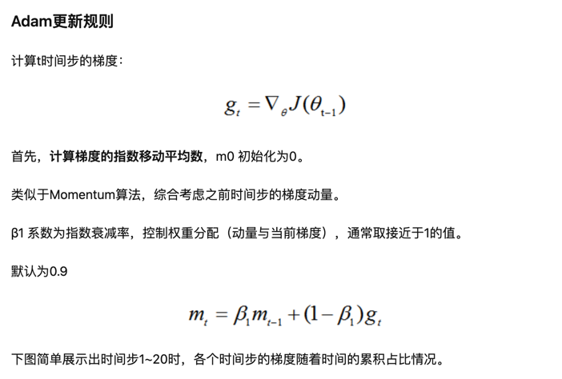
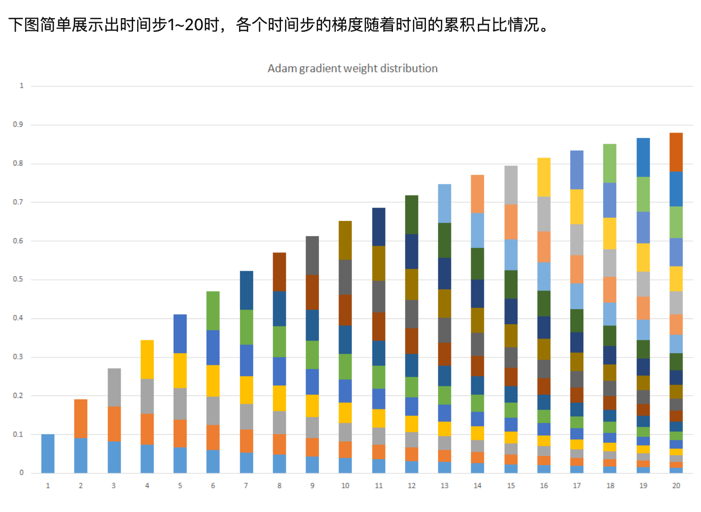
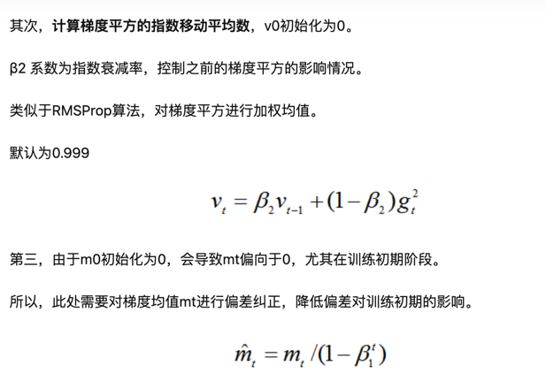
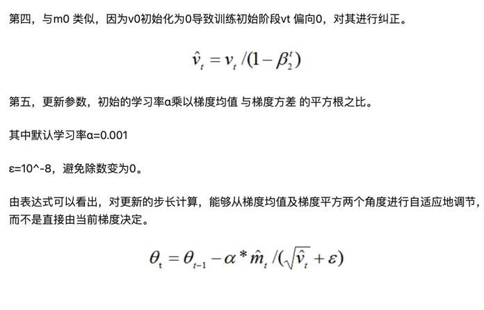

1. 为什么选择PLE，为什么不拆开，序列，多目标优势 
### 为什么需要多目标模型？
 1. **一句话概括**：
 - 模型统一，方便高效效果好，以及那内心深处的呐喊：
 2. **几句话阐述**：
 - 如上面短视频和hotpotqa的多任务模型例子：方便，一次搞定多个任务，这点对工业界来说十分友好。 假设要用k个模型预测k个任务， 
那么k个模型预测的时间成本、计算成本、存储成本、甚至还有模型的维护成本都是大于一个模型的， 咱们聪明的算法小哥哥小姐姐们当然更喜欢多任务学习了，
除非多任务学习的效果远远低于单任务学习。
 - 多任务学习不仅方便，还可能效果更好！针对很多数据集比稀疏的任务，比如短视频转发，大部分人看了一个短视频是不会进行转发这个操作的 这么稀疏的行为，
模型是很难学好的（过拟合问题严重），那我们把预测用户是否转发这个稀疏的事情和用户是否点击观看这个经常发生事情放在一起学，一定程度上会缓解模型的过拟合，提高了模型的泛化能力。
多任务学习能提高泛化能力，
 - 从另一个角度来看，对于数据很少的新任务，也解决了所谓的“冷启动问题”。
 - 多个任务放一起学的另一个好处：数据增强，不同任务有不同的噪声，假设不同任务噪声趋向于不同的方向，放一起学习一定程度上会抵消部分噪声，
使得学习效果更好，模型也能更鲁棒。NLP和CV中经常通过数据增强的方式来提升单个模型效果，多任务学习通过引入不同任务的数据，自然而言有类似的效果。
任务互助，某些任务所需的参数可以被其他任务辅助训练的更好，比如任务A由于各种限制始终学不好W1，但是任务B却可以轻松将W1拟合到适合任务A所需的状态，A和B搭配，干活儿不累～。

### 常见优化器
[简单认识Adam优化器](https://zhuanlan.zhihu.com/p/32698042)

[Adam优化器杂谈](https://zhuanlan.zhihu.com/p/165639576)

[优化器怎么选？一文教你选择适合不同ML项目的优化器](https://zhuanlan.zhihu.com/p/342003515)

### **AdaGrad:**

>- 优势：在数据分布稀疏的场景，能更好利用稀疏梯度的信息，比标准的SGD算法更有效地收敛。
>- 缺点：主要缺陷来自分母项的对梯度平方不断累积，随之时间步地增加，分母项越来越大，最终导致学习率收缩到太小无法进行有效更新。

### **RMSProp**

>- 优势：能够克服AdaGrad梯度急剧减小的问题，在很多应用中都展示出优秀的学习率自适应能力。尤其在不稳定(Non-Stationary)的目标函数下，比基本的SGD、Momentum、AdaGrad表现更良好。

### **Adam优化器**
2014年12月， Kingma和Lei Ba两位学者提出了Adam优化器，结合AdaGrad和RMSProp两种优化算法的优点。
对梯度的一阶矩估计（First Moment Estimation，即梯度的均值）和二阶矩估计（Second Moment Estimation，即梯度的未中心化的方差
）进行综合考虑，计算出更新步长。

- 主要包含以下几个显著的优点：

: 1. 实现简单，计算高效，对内存需求少
: 2. 参数的更新不受梯度的伸缩变换影响
: 3. 超参数具有很好的解释性，且通常无需调整或仅需很少的微调
: 4. 更新的步长能够被限制在大致的范围内（初始学习率）
: 5. 能自然地实现步长退火过程（自动调整学习率）
: 6. 很适合应用于大规模的数据及参数的场景
: 7. 适用于不稳定目标函数
: 8. 适用于梯度稀疏或梯度存在很大噪声的问题

- 综合Adam在很多情况下算作默认工作性能比较优秀的优化器.

